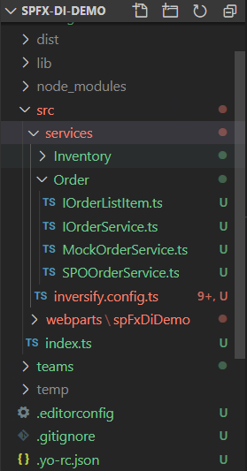

# @ezcode/spfx-di

## Introduction

@ezcode/spfx-di is a component to help developers to create Service by using dependency injection. 

## Usage
1. reference @ezcode/spfx-di by using
   * `npm link @ezcode/spfx-di` if you use npm link 
   * `npm install @ezcode/spfx-di --save` if you use it from npm repository. 
2. install the following required npm packages: 
```bash
npm install inversify reflect-metadata --save
```
3. add follwoing files as the following structures
   
4. add "src/services/Orders/IOrderService.ts"
   
```Typescript
import { IServiceBase } from '@ezcode/spfx-di/lib';
import { WebPartContext } from '@microsoft/sp-webpart-base';
import { IOrderListItem } from './IOrderListItem';

export interface IOrderService extends IServiceBase<WebPartContext> {
  getOrders(): Promise<IOrderListItem[]>;
}

```
5. add "src/services/Orders/MockOrderService.ts"
```Typescript
import { IOrderService } from './IOrderService';
import { WebPartContext } from '@microsoft/sp-webpart-base';
import { injectable, inject } from 'inversify';
import { IInventoryService } from '../index';
import { ServiceFactory, IServiceFactory } from '@ezcode/spfx-di/lib';
import { IOrderListItem } from './IOrderListItem';

@injectable()
export class MockOrderService implements IOrderService {
  public webPartContext: WebPartContext;
  private _invnetoryService: IInventoryService;

  //if you want to inject other services in this service
  constructor(
    @inject(ServiceFactory.getServiceFactoryName('IInventoryService'))
    inventoryServiceFactory: IServiceFactory<IInventoryService>
  ) {
    this._invnetoryService = inventoryServiceFactory();
  }
  public getOrders(): Promise<IOrderListItem[]> {
    console.log(this._invnetoryService.getInventory());
    return new Promise(resolve => {
      let ret = new Array<IOrderListItem>();
      ret.push({
        ID: 1,
        Title: 'Test',
        Price: 1.99,
        OrderType: 'Meat'
      });
      resolve(ret);
    });
  }
}

```
6. add "src/services/Orders/SPOOrderService.ts"
```Typescript
import { IOrderService } from './IOrderService';
import { WebPartContext } from '@microsoft/sp-webpart-base';
import { injectable, inject } from 'inversify';
import { ServiceFactory, IServiceFactory } from '@ezcode/spfx-di/lib';
import { IInventoryService } from '../Inventory/IInventoryService';
import { IOrderListItem } from './IOrderListItem';
import { sp } from "@pnp/sp";
import "@pnp/sp/webs";
import "@pnp/sp/lists";
import "@pnp/sp/items";

@injectable()
export class SPOOrderService implements IOrderService {
  public webPartContext: WebPartContext;
  private _invnetoryService: IInventoryService;
  //if you want to 
  constructor(
    @inject(ServiceFactory.getServiceFactoryName('IInventoryService'))
    inventoryServiceFactory: IServiceFactory<IInventoryService>
  ) {
    this._invnetoryService = inventoryServiceFactory();
  }
  public getOrders(): Promise<IOrderListItem[]> {
    console.log(this._invnetoryService.getInventory());
    return sp.web.lists.getByTitle('OrderList').items.getAll()
      .then(result => {
        return result.map(item => {
          return {
            Title: item['Title'],
            ID: item['ID'],
            Price: item['Price'],
            OrderType: item['OrderType']
          };
        });
      });
  }
}
```
7. add "src/services/inversify.config.ts" to register your service classes. 
```Typescript
import { EnvironmentType, Environment } from '@microsoft/sp-core-library';
import { WebPartContext } from '@microsoft/sp-webpart-base';

import 'reflect-metadata';
import { SPFxContainer } from '@ezcode/spfx-di/lib';
import { SPOInventoryService, MockInventoryService } from '.';
import { MockOrderService } from './order/MockOrderService';
import { SPOOrderService } from './order/SPOOrderService';

export const TYPES = {
  InventoryService: 'IInventoryService',
  OrderService: 'IOrderService'
};

export const mainContainer = new SPFxContainer<WebPartContext>([
  {
    serviceKey: TYPES.InventoryService,
    serviceItems: [
      {
        targetName: EnvironmentType.SharePoint.toString(),
        service: SPOInventoryService
      },
      {
        targetName: EnvironmentType.Local.toString(),
        service: MockInventoryService
      }

    ]
  },
  {
    serviceKey: TYPES.OrderService,
    serviceItems: [
      {
        targetName: EnvironmentType.SharePoint.toString(),
        service: SPOOrderService
      },
      {
        targetName: EnvironmentType.Local.toString(),
        service: MockOrderService
      }

    ]
  }
], Environment.type.toString());
```
8. invoke the registration from your web part ex. SpFxDiDemoWebPart.ts

```Typescript
import "reflect-metadata";
import { sp } from '@pnp/sp/presets/all';
import { mainContainer } from "../../services";

export default class DiDemoWebPart extends BaseClientSideWebPart<IDiDemoWebPartProps> {

  protected async onInit(): Promise<void> {
    return super.onInit().then(_ => {
      sp.setup({
        spfxContext: this.context
      });

      mainContainer.registerWebPartContext(this.context);
    });
    // await super.onInit();
    // // other init code may be present
    // //init spfx-di
    // mainContainer.registerWebPartContext(this.context);

    // sp.setup(this.context);
  }

  public render(): void {
      ...
  }

  protected onDispose(): void {
    ReactDom.unmountComponentAtNode(this.domElement);
  }

  protected get dataVersion(): Version {
    return Version.parse('1.0');
  }

  protected getPropertyPaneConfiguration(): IPropertyPaneConfiguration {
      ...
  }
}

```

9.  use them from your components diDemo/DiDemo.tsx
```Typescript
import * as React from 'react';
import styles from './DiDemo.module.scss';
import { IDiDemoProps } from './IDiDemoProps';
import { escape } from '@microsoft/sp-lodash-subset';
import { PrimaryButton, autobind } from 'office-ui-fabric-react';

import "reflect-metadata";
import { IOrderService, IInventoryService, mainContainer, TYPES } from '../../../services';
import { PropertyInject, InjectAutoInit } from '@ezcode/spfx-di/lib';
import { IDiDemoState } from './IDiDemoState';

// Add "InjectAutoInit" attribute
@InjectAutoInit
export default class DiDemo extends React.Component<IDiDemoProps, IDiDemoState> {
  // Add "PropertyInject" attribute to automatically init service variable
  // typeKey: this is the type key defined in inversify.config.ts
  // container: this is the IoC container
  @PropertyInject({
    typeKey: TYPES.InventoryService,
    container: mainContainer.Container
  })
  private _inventoryService: IInventoryService;

  @PropertyInject({
    typeKey: TYPES.OrderService,
    container: mainContainer.Container
  })
  private _orderService: IOrderService;

  constructor(props: IDiDemoProps) {
    super(props);

    this.state = {
      result: "",
      loading: false,
    };
  }

  @autobind
  private _testHandler(): void {
    this.setState({ loading: true });
    // _orderService will be initialized
    this._orderService.getOrders()
      .then(result => {
        this.setState({
          loading: false,
          result: JSON.stringify(result, null, 4)
        });
      });
  }

  public render(): React.ReactElement<IDiDemoProps> {
    return (
      <div className={styles.diDemo}>
        <div className={styles.container}>
          <div className={styles.row}>
            <div className={styles.column}>
              <PrimaryButton text='Test' onClick={this._testHandler} />
            </div>
          </div>
          <div className={styles.row}>
            <div className={styles.columnResult}>
              {this.state.result}
            </div>
          </div>
        </div>
      </div>
    );
  }
}

```

## Building the code
* install packages
  * If you install from npm repo, type `npm install --package-lock` to regenerate package-lock.json
  * If you install from your private repo:
    * Add .npmrc file and include the following: 
    ```json
    registry=(https://your-npm-registry)
    always-auth=true
    ```
    * Authenticate your private repo by running: `npm run refreshVSToken`
    * install pacakages by running `npm install --package-locak` to regenerate package-lock.json
* build code: `npm run build`
* register your npm repository: `npm run refreshVSToken`
* publish your code: `npm publish`

## Version
* 1.0.0: init version